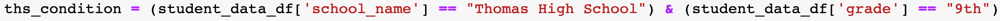
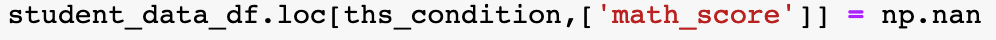
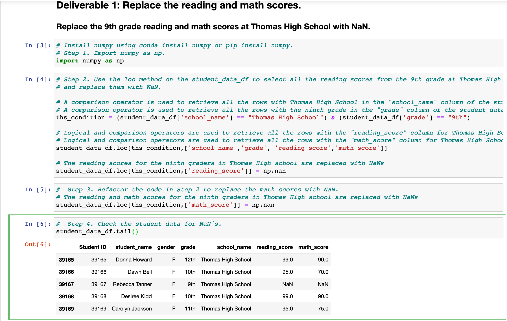

# School-District-Analysis

# Overview

Here is the list of deliverables for the analysis of the school district: 

    A high-level snapshot of the district's key metrics, presented in a table format
    An overview of the key metrics for each school, presented in a table format
    Tables presenting each of the following metrics:
        Top 5 and bottom 5 performing schools, based on the overall passing rate
        The average math score received by students in each grade level at each school
        The average reading score received by students in each grade level at each school
        School performance based on the budget per student
        School performance based on the school size 
        School performance based on the type of school

# Deliverable 1: Replace Ninth-Grade Reading and Math Scores

"Using the Pandas loc method with conditional statements and comparison and logical operators, select the ninth-grade reading and math scores for Thomas High School. Then, use the Pandas NumPy module to change the reading and math scores to NaN."

The following are to illustrate the findings for the Deliberable 1 requirements. The instruction of each requirement is given with the corresponding illustration.

Deliverable 1. Requirement 1. "A comparison operator is used to retrieve all the rows with Thomas High School in the "school_name" column of the student_data_df"
Deliverable 1. Requirement 2. "A comparison operator is used to retrieve all the rows with the ninth grade in the "grade" column of the student_data_df"

Deliverable 1. Requirement 3. "Logical and comparison operators are used to retrieve all the rows with the "reading_score" column for Thomas High School ninth graders from the student_data_df"
Deliberable 1. Requirement 4. "Logical and comparison operators are used to retrieve all the rows with the "math_score" column for Thomas High School ninth graders from the student_data_df"

Deliverable 1. Requirement 5. "The reading and math scores for the ninth graders in Thomas High school are replaced with NaNs"

Deliverable 1 Outcome.

# Deliverable 2: Replace Ninth-Grade Reading and Math Scores
