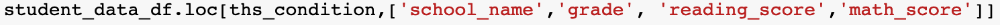
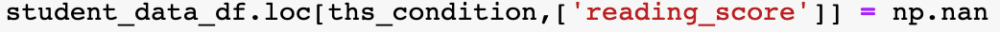

# School-District-Analysis

# Overview

**Background**

"The school board has notified Maria and her supervisor that the students_complete.csv file shows evidence of academic dishonesty; specifically, reading and math grades for Thomas High School ninth graders appear to have been altered. Although the school board does not know the full extent of the academic dishonesty, they want to uphold state-testing standards and have turned to Maria for help. She has asked you to replace the math and reading scores for Thomas High School with NaNs while keeping the rest of the data intact. Once you’ve replaced the math and reading scores, Maria would like you to repeat the school district analysis that you did in this module and write up a report to describe how these changes affected the overall analysis."

**Purpose**

The purpose of this analysis is to establish the following:

"A high-level snapshot of the district's key metrics, presented in a table format
An overview of the key metrics for each school, presented in a table format
Tables presenting each of the following metrics:
- Top 5 and bottom 5 performing schools, based on the overall passing rate
- The average math score received by students in each grade level at each school
- The average reading score received by students in each grade level at each school
- School performance based on the budget per student
- School performance based on the school size 
- School performance based on the type of school"

# Results

# Deliverable 1: Replace Ninth-Grade Reading and Math Scores

**Deliverable 1 Instructions**

"Using the Pandas loc method with conditional statements and comparison and logical operators, select the ninth-grade reading and math scores for Thomas High School. Then, use the Pandas NumPy module to change the reading and math scores to NaN."

The following are to illustrate the findings for the Deliberable 1 requirements. The instruction of each requirement is given with the corresponding illustration.

Deliverable 1. Requirement 1. "A comparison operator is used to retrieve all the rows with Thomas High School in the "school_name" column of the student_data_df"

Deliverable 1. Requirement 2. "A comparison operator is used to retrieve all the rows with the ninth grade in the "grade" column of the student_data_df"
*see above*

Deliverable 1. Requirement 3. "Logical and comparison operators are used to retrieve all the rows with the "reading_score" column for Thomas High School ninth graders from the student_data_df"

Deliberable 1. Requirement 4. "Logical and comparison operators are used to retrieve all the rows with the "math_score" column for Thomas High School ninth graders from the student_data_df"
*see above*

Deliverable 1. Requirement 5. "The reading and math scores for the ninth graders in Thomas High school are replaced with NaNs"

Deliverable 1 Outcome.

# Deliverable 2: Repeat the School District Analysis

**Deliverable 2 Instructions**

"Repeat the school district analysis you did in this module, and recreate the following metrics:
- The district summary
- The school summary
- The top 5 and bottom 5 performing schools, based on the overall passing rate
- The average math score for each grade level from each school
- The average reading score for each grade level from each school
- The scores by school spending per student, by school size, and by school type"

The following are to illustrate the findings for the Deliberable 2 requirements. The instruction of each requirement is given with the corresponding illustration.

Deliverable 2. Requirement 1. "The district summary DataFrame" 

Deliverable 2. Requirement 2. "The school summary DataFrame" 

Deliverable 2. Requirement 3. "The top 5 performing schools, based on the overall passing rate" 

Deliverable 2. Requirement 4. "The bottom 5 performing schools, based on the overall passing rate" 

Deliverable 2. Requirement 5. "The average math score for each grade level from each school" 

Deliverable 2. Requirement 6. "The average reading score for each grade level from each school" 

Deliverable 2. Requirement 7. "The scores by school spending per student" 

Deliverable 2. Requirement 8. "The scores by school size" 

Deliverable 2. Requirement 9. "The scores by school type"

# Discussion

# Deliverable 3: A Written Report for the School District Analysis

**The analysis should contain the following:**

"Overview of the school district analysis: Explain the purpose of this analysis."
*See Above in the Introduction

"Results: Using bulleted lists and images of DataFrames as support, address the following questions."

How is the district summary affected?

How is the school summary affected?

How does replacing the ninth graders’ math and reading scores affect Thomas High School’s performance relative to the other schools?

How does replacing the ninth-grade scores affect the following:
- Math and reading scores by grade

- Scores by school spending

- Scores by school size

- Scores by school type

"Summary: Summarize four major changes in the updated school district analysis after reading and math scores for the ninth grade at Thomas High School have been replaced with NaNs."
